# image_binarization
This repo contains three simple image binarization algorithms:
- [Otsu method](src/otsu.cpp)
- [Unbalanced Otsu method](src/unbalanced_otsu.cpp)
- [Kittler-Illingworth method](kittler.cpp)

# Requirements
- OpenMP
- Magick++

# Build
``` sh
mkdir build
cmake -DCMAKE_BUILD_TYPE=Release ..
make
```

# Run
To run program you must give 3 arguments:
1) threshold finding algorithm (otsu, unbalanced_otsu, kittler)
2) input image file name
3) output image file name

# Examples
The pictures were taken from [here](http://vc.ee.duth.gr/h-dibco2018/benchmark/dibco2018_Dataset.zip).

Picture are shown in next order:
1) original
2) Otsu
3) unbalanced Otsu
4) Kittler-Illingworth

## Image 1
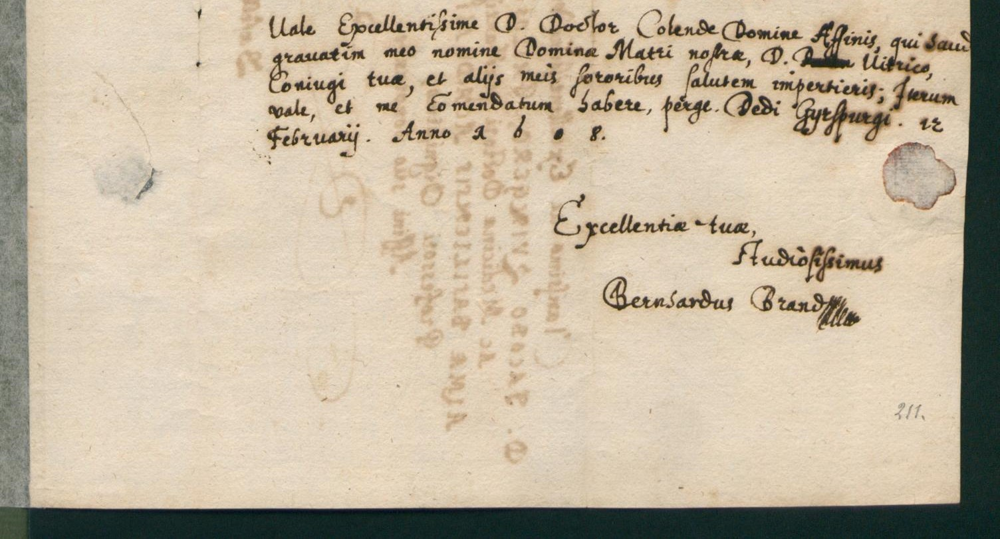
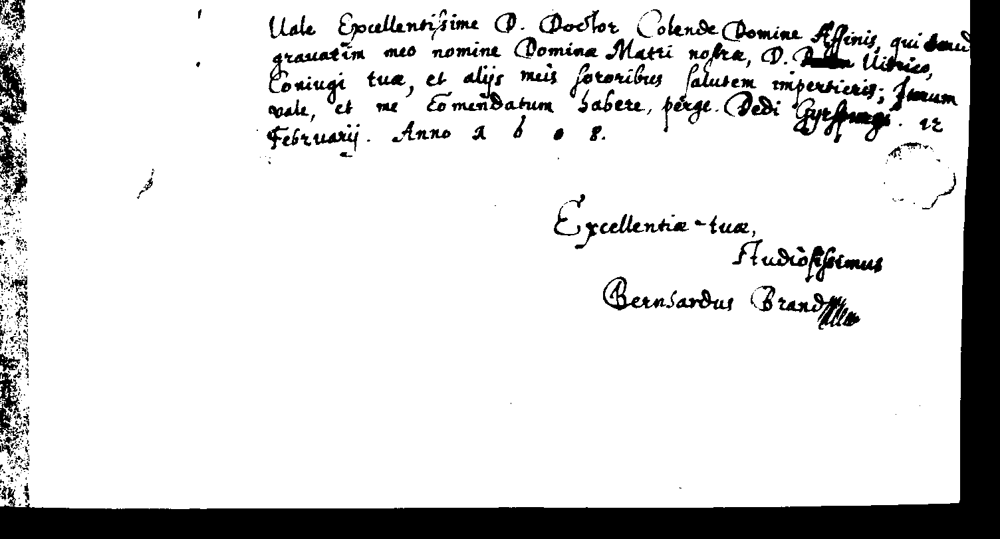
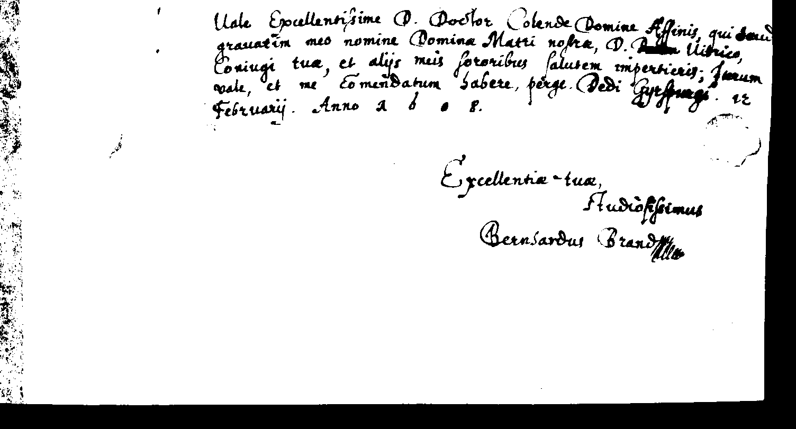
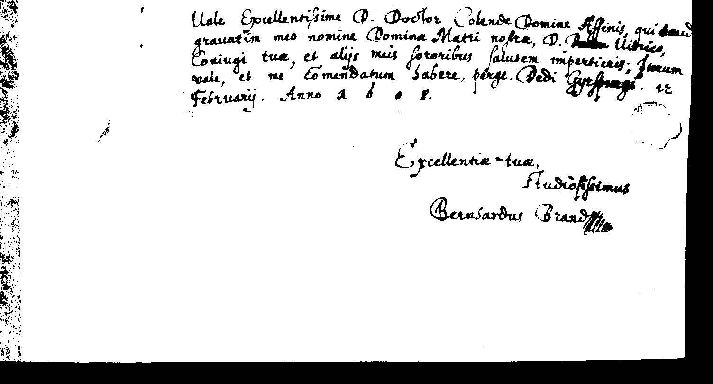

## Image 2
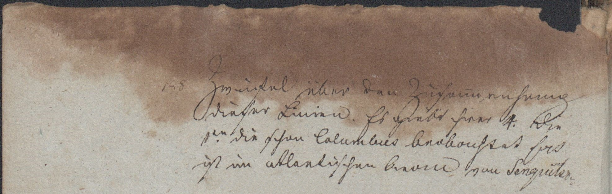
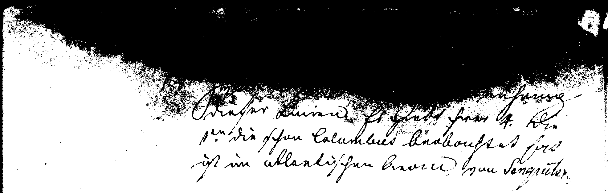

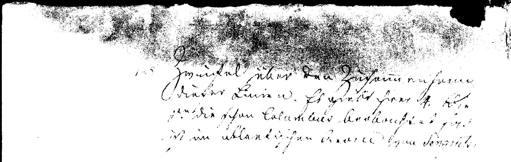

## Image 3
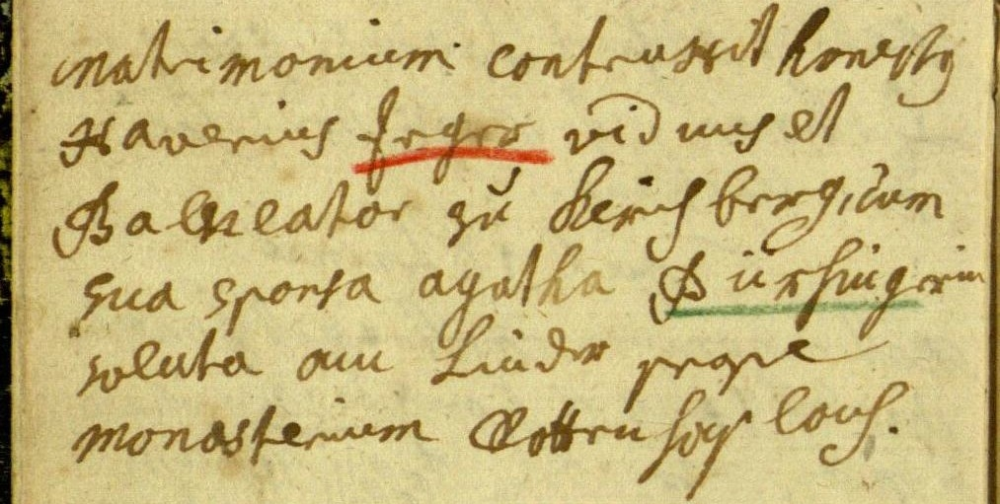
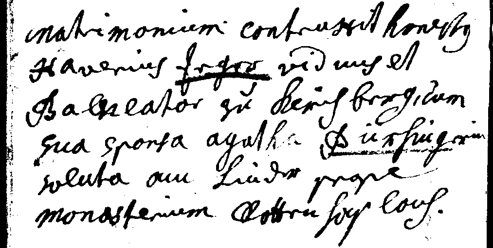
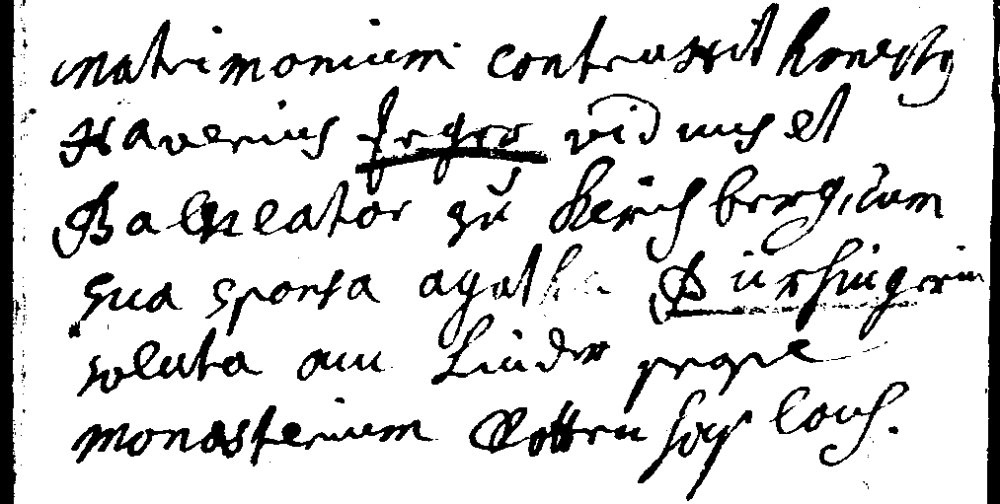
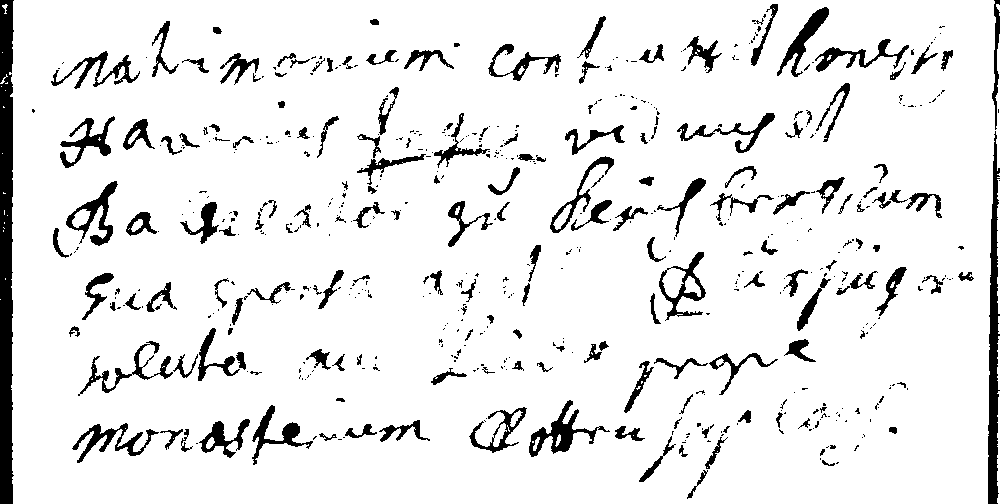

## Image 4
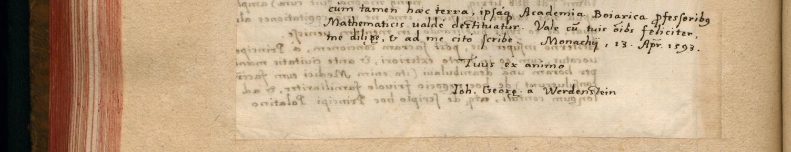
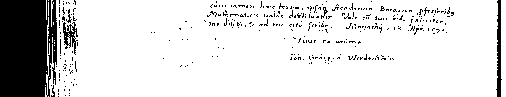
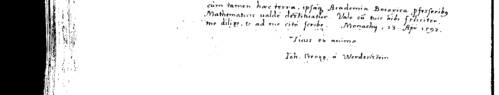
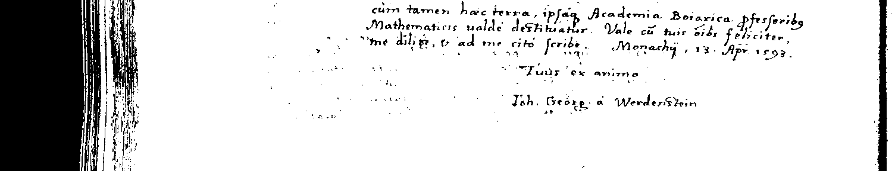

## Image 5

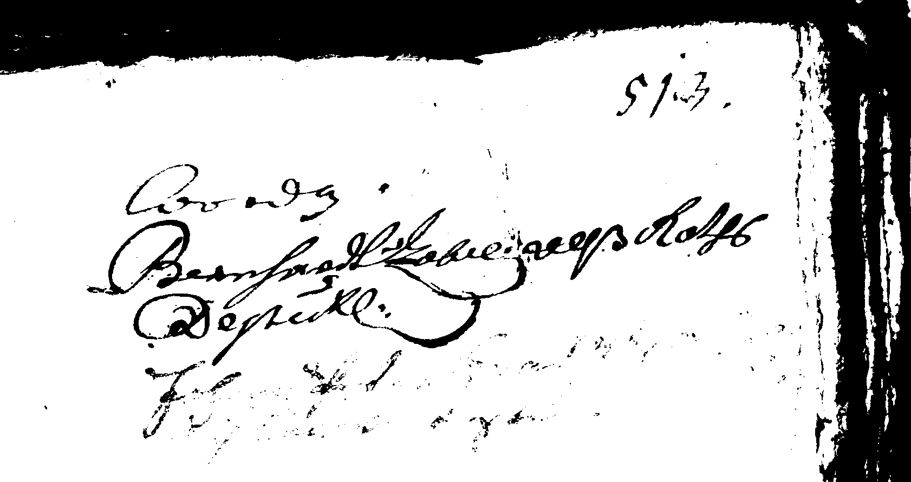
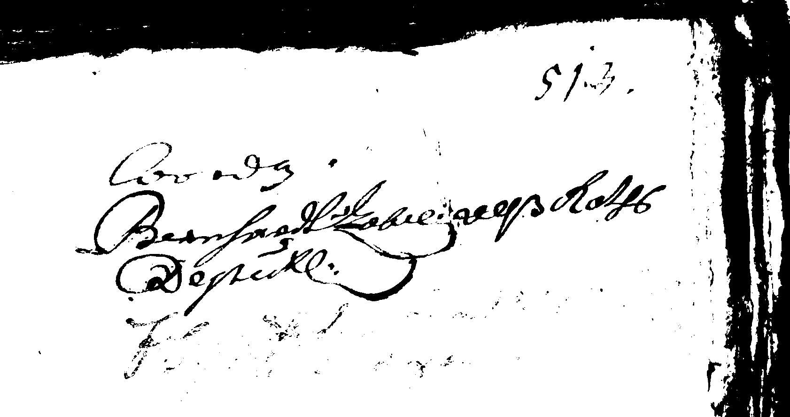
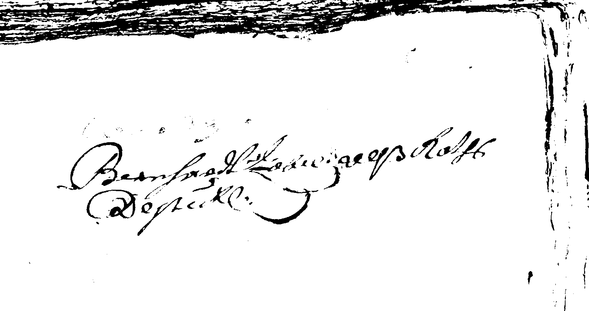

## Image 6


## Image 7

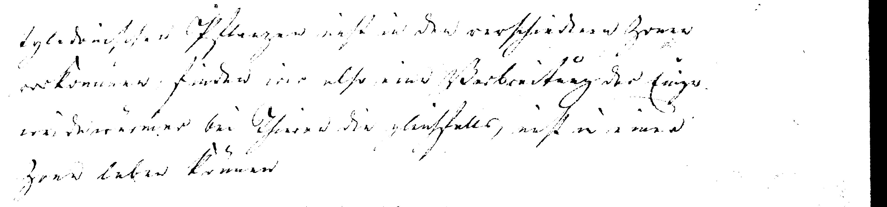
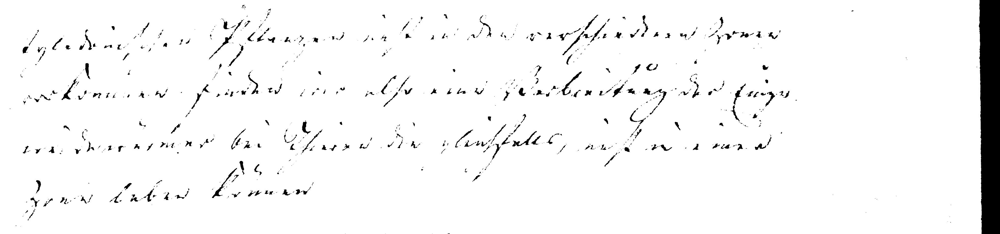
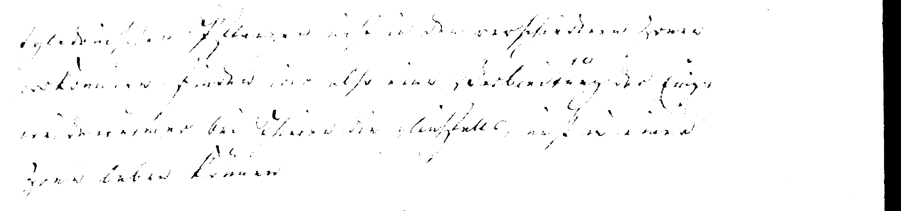

## Image 8
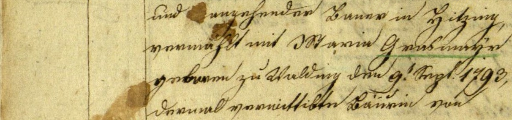
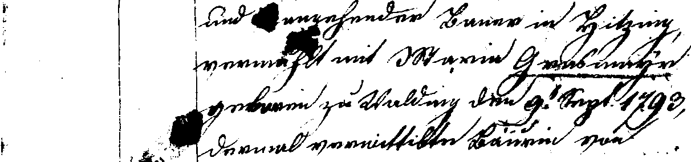
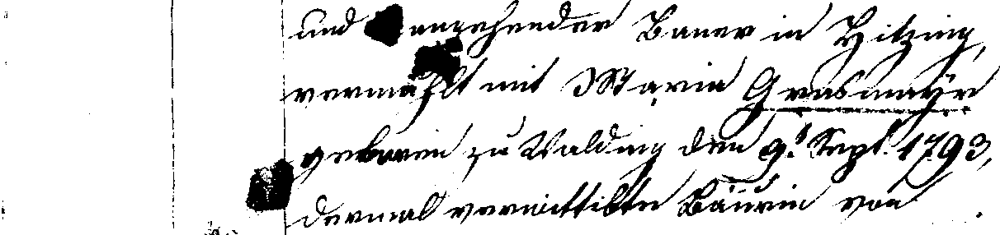
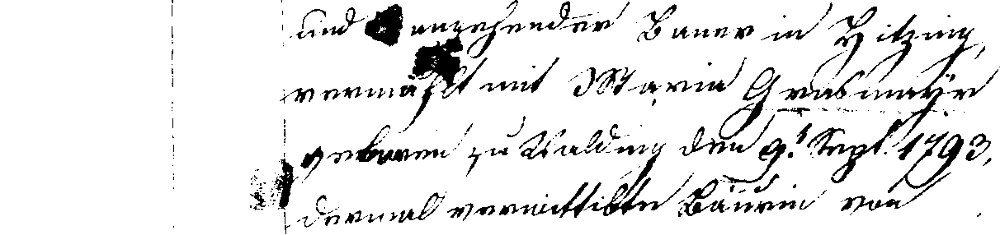

## Image 9


## Image 10
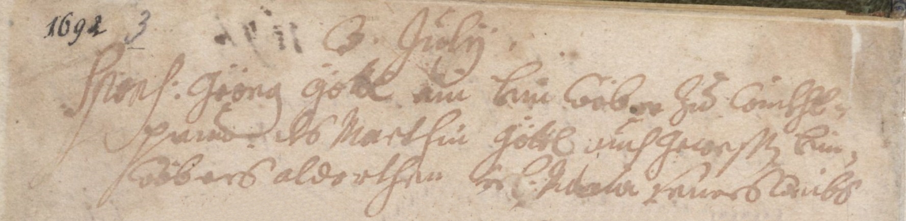
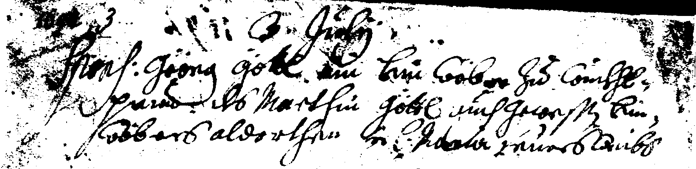
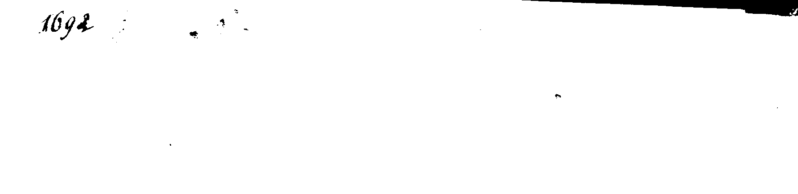
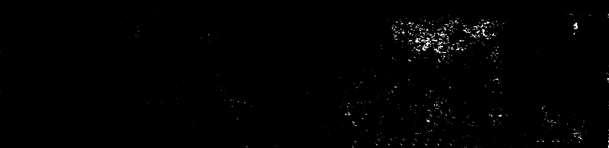
